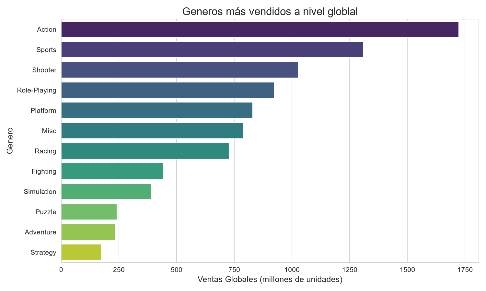
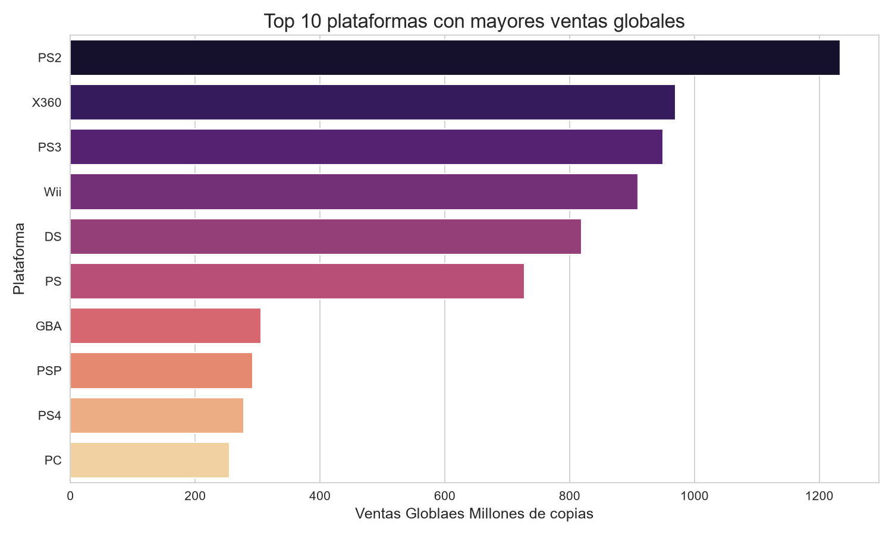
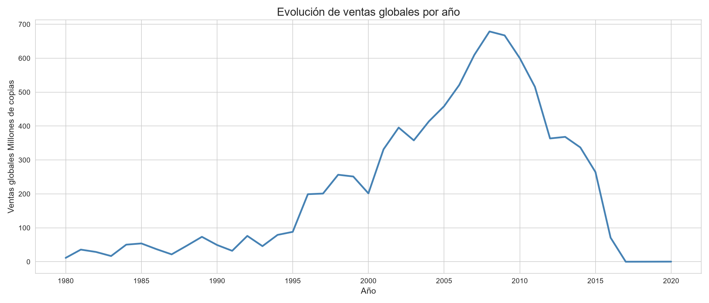
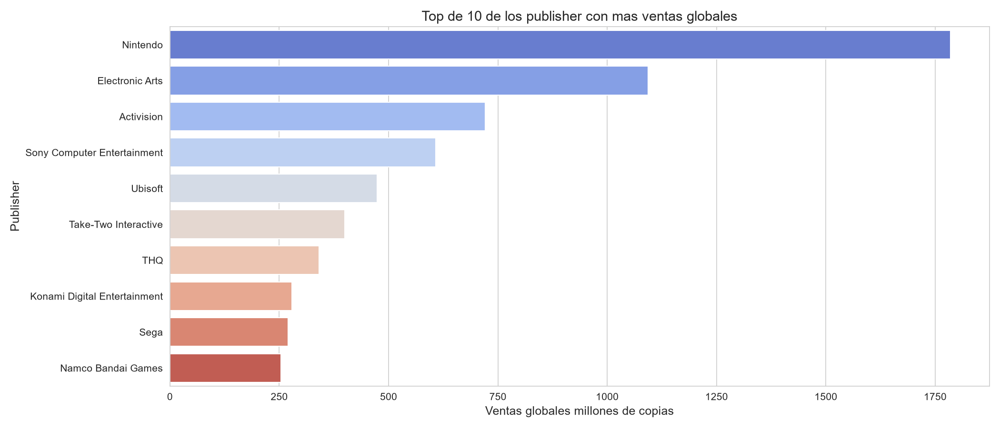
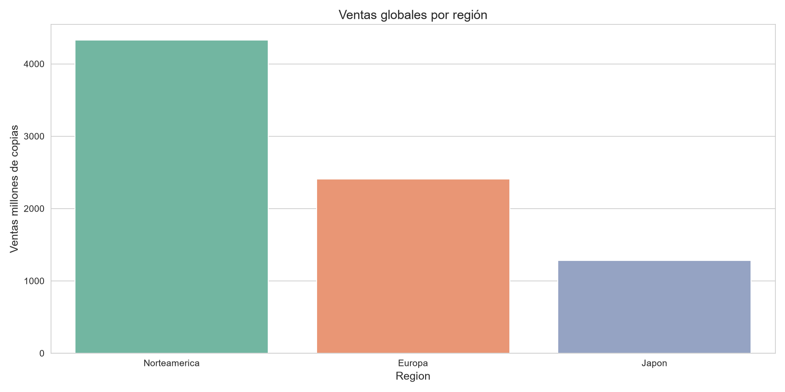
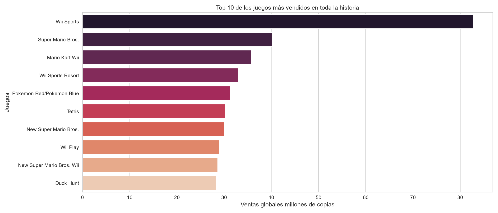

# 🎮 Análisis de Ventas Globales de Videojuegos

Análisis exploratorio de datos sobre las ventas de más de 16,000 videojuegos a nivel mundial, cubriendo 40 años de historia de la industria (1980-2020). Este proyecto responde 6 preguntas de negocio mediante limpieza de datos, análisis estadístico y visualizaciones con Python.

> 📁 Este proyecto forma parte de mi portafolio de Ciencia de Datos, donde estoy documentando mi proceso de aprendizaje como Tecnólogo en Análisis y Desarrollo de Software
---

## 🎯 Preguntas que responde este análisis

| # | Pregunta |
|---|----------|
| 1 | ¿Cuáles son los géneros más vendidos a nivel global? |
| 2 | ¿Qué plataforma domina las ventas? |
| 3 | ¿Cómo han evolucionado las ventas por año? |
| 4 | ¿Qué publishers generan más ingresos? |
| 5 | ¿Existen diferencias entre mercados? (Norteamérica, Europa, Japón) |
| 6 | ¿Qué juego fue el más vendido de la historia del dataset? |

---

## 🛠️ Tecnologías utilizadas

- **Python 3.13**
- **pandas** — manipulación y limpieza de datos
- **matplotlib** y **seaborn** — visualización de datos
- **Jupyter Notebook** — desarrollo interactivo

---

## 📁 Estructura del proyecto

```
Proyecto_01_Analisis_Ventas/
│
├── data/
│   ├── raw/                    # Dataset original sin modificar
│   └── processed/              # Dataset limpio, listo para análisis
│
├── notebooks/
│   ├── 01_exploracion.ipynb    # Exploración inicial del dataset (EDA)
│   ├── 02_limpieza.ipynb       # Limpieza y corrección de datos
│   └── 03_analisis.ipynb       # Análisis y visualizaciones
│
├── resultados/
│   └── graficas/                # Gráficas generadas en PNG
│
├── src/
│   └── utils.py
│
├── .gitignore
├── README.md
└── requirements.txt
```

---

## 📊 Resultados

### 1. Géneros más vendidos a nivel global



**Action** es el género dominante con casi 1,750 millones de copias vendidas, seguido de Sports y Shooter.

### 2. Plataformas con más ventas



**PS2** lidera con más de 1,200 millones de copias. Las consolas de PlayStation ocupan 4 de los 10 primeros puestos.

### 3. Evolución de ventas por año



Las ventas crecieron de forma sostenida hasta alcanzar su punto más alto en **2008**, año en el que coincidieron el éxito de la Wii, PS3 y Xbox 360.

### 4. Publishers con más ventas



**Nintendo** prácticamente duplica las ventas de su competidor más cercano, Electronic Arts.

### 5. Diferencias entre mercados



**Norteamérica** es el mercado más grande, triplicando las ventas de Japón.

### 6. El juego más vendido de la historia



**Wii Sports** es el juego más vendido del dataset, con 82.74 millones de copias — venía incluido gratis con la consola Wii.

---

## 📋 Lo que encontré en este análisis

Después de meterle mano a casi 16,300 videojuegos, esto fue lo que más me llamó la atención:

- **El género Action es el rey absoluto**, con casi 1,750 millones de copias vendidas. Sports y Shooter le siguen de cerca, pero nada se le acerca de verdad.
- **PS2 fue la consola que más vendió** de todas, con más de 1,200 millones de copias. Curioso que de las 31 plataformas del dataset, las de PlayStation se llevan 4 puestos del Top 10.
- **2008 fue el año dorado de la industria** según este dataset, y después empieza a caer. Ojo: esto probablemente no es que la industria colapsó, sino que los datos más recientes simplemente no se terminaron de recolectar bien (es algo común en datasets scrapeados de la web).
- **Nintendo no tiene competencia.** Casi duplica en ventas a Electronic Arts, que queda en segundo lugar. Y no es casualidad, porque cuando miro el Top 10 de juegos más vendidos de la historia, los 10 son de Nintendo.
- **Norteamérica es, por mucho, el mercado más grande**, triplicando las ventas de Japón.
- Y el dato que cierra el análisis: **Wii Sports es el juego más vendido de todos**, con 82.74 millones de copias. Tiene sentido, venía incluido gratis con la consola.

### 🎮 Mi conclusión personal

Lo que más se repite en este análisis es Nintendo. Aparece arriba en publishers, en plataformas (gracias a la Wii) y domina el ranking de juegos individuales. Da la sensación de que su jugada de controlar tanto el hardware como el software les funcionó increíblemente bien — no solo vendían consolas, vendían también los juegos más populares para esas consolas.

---

## 🚀 Cómo ejecutar este proyecto

1. Clona el repositorio
```bash
git clone https://github.com/joanjz10/analisis-ventas-videojuegos.git
cd analisis-ventas-videojuegos

2. Instala las dependencias
```bash
pip install -r requirements.txt
```

3. Abre los notebooks en orden desde la carpeta `notebooks/`:
   - `01_exploracion.ipynb`
   - `02_limpieza.ipynb`
   - `03_analisis.ipynb`

---

## 📬 Contacto

**Joan Steven Jiménez**

- GitHub: [@joanjz10](https://github.com/joanjz10)
- LinkedIn: [Joan Jiménez](https://www.linkedin.com/in/joan-jim%C3%A9nez-826910342)